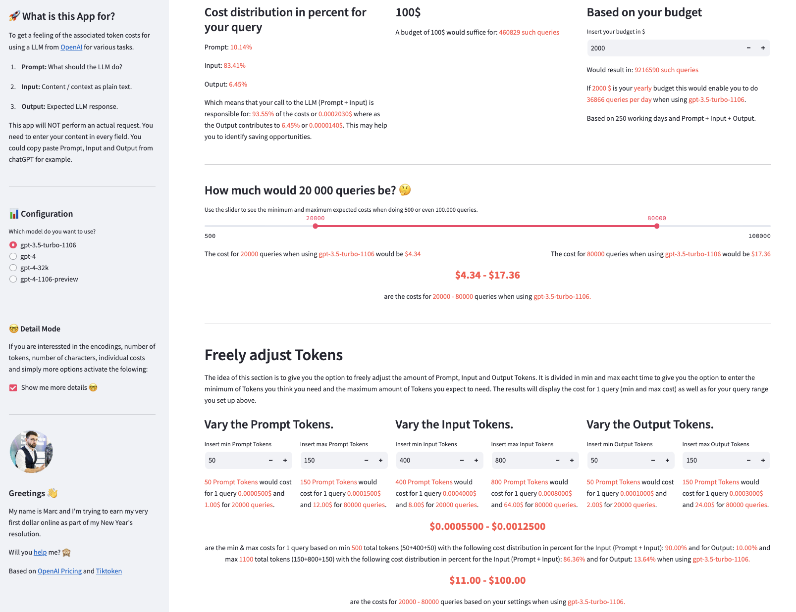

# 💸 Token Cost Calculator

Ever wondered:
- how much your chatGPT query would actually cost?
- how the costs of a query are split up and where to optimize first?
- how many queries you could do with 100$
- what the costs would be if you do 20.000 classifications with a Language Model?
  
### Use it for free here
[Token Cost Calculator](https://tokencostcalculator.streamlit.app/)

## Quick Install
with pip:
```bash
pip install -r requirements.txt
```

run the app:
```bash
streamlit run main.py
```

## 🤔 What is the Token Cost Calculator?

**Token Cost Calculator** is a tool to get a feeling of the the costs associated with OpenAI queries for the models gpt-3.5 and gpt-4.
The Tool does not actually send any Prompts or generates Output from a LLM. You need to feed it with your examples. ChatGPT is a good place to get started. I encourage you to think about your Prompt, the context you give the prompt and the desired output you are expecting from the LLM.
The Token Cost Calculator will give you the total costs for your query.


If you activate "Detail Mode" in the sidepanel/menu it also gives you the option to:
- see what are the costs assigned to each part of your query
- see the cost distribution in percent
- see the encodings of your input
- see how many queries you could do with 100$
- see how much it would cost to do 500 or even 100.000 queries
- freely adjust the amount of Prompt, Input and Output tokens



### How this app got build
Day 1:
- Basic setup: installing python, setting up the environment, pip install streamlit, tiktoken, openai
- Building basic function: API Call to TIKTOKEN
- hardcoded pricing for one model according to the pricing page of OpenAI
- Making simple calculations based on the number of tokens and pricing
- Displaying costs - which changes when the text fields get other content
- MVP is working.

Day 2:
- Adding a "BUY ME A COFFEE" Button.
- Adding a sidepanel with radio buttons (choose the model you want to use) as well as the BMAC Button
- Refactoring the code: sidepanel will now change the variables for the calculation
- Adding a little bit more explanation and styling

Day 3:
- more explanations and a predefined template
- some UI improvements
- adding first advanced thing (show encoding and output)
- working with chatGPT to get some ideas on how to solve things .. but fallback to streamlit documentation
- adding a picture
- added 2 Links
- set page config
- comment in the community forum

Day 4:
- further UI enhancements
- add slider for prognose of cost 500-100000 requests
- added a chart (not happy with it)

Day 5:
- setup source control
- setup ko-fi

Day 6:
- added requirements.txt
- code and comment clean up
- add detail mode (show encoding and single costs + token and character amount)
- add variance as a slider (%) for input and output - calculate if I have between -50% and + 200% more or less input / output

Day 7
- slider was a bad idea .. make input fields
- make it more relateable - add something like: for 100$ you could do X amount of calls
- added a specific prompt field
- rebuild some of the columns

Day 8
- add information page about tokens (4 characters are one token etc.)
- think about explanations
- hide everything for detail mode
- think about theming (color scheme)

publish.
